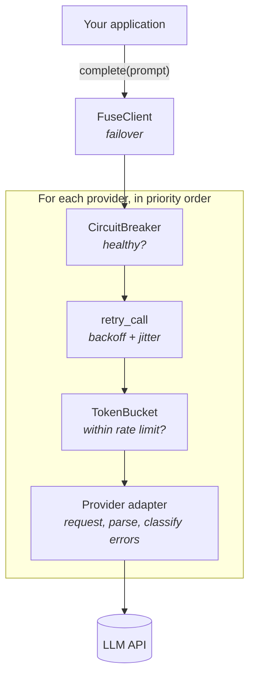
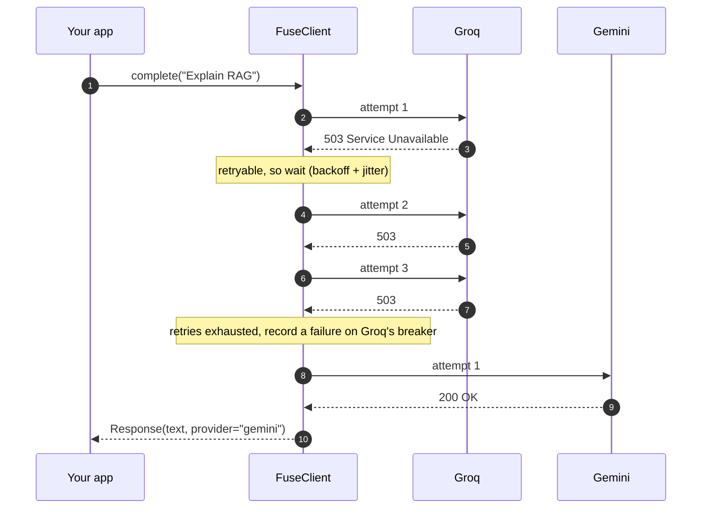
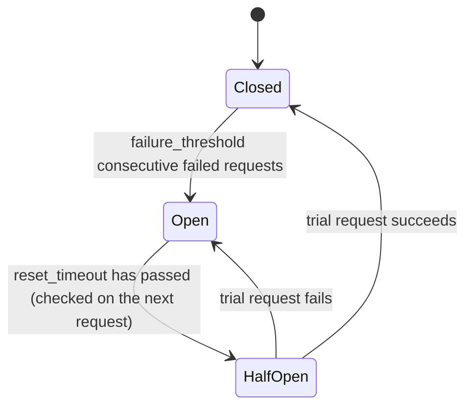
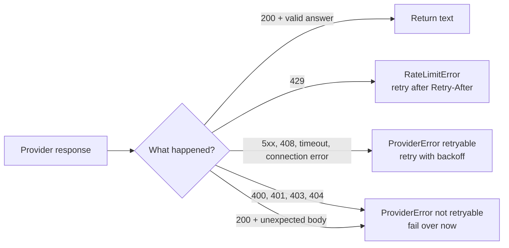

<div align="center">

# llmfuse

**Production-grade reliability for LLM calls.**
<br/>
Retries with backoff · Circuit breakers · Rate limiting · Multi-provider failover. One call.

[](https://github.com/AaryanBairagi/llmfuse/actions/workflows/ci.yml)
[](https://pypi.org/project/llmfuse/)
[](https://www.python.org)
[](https://github.com/AaryanBairagi/llmfuse/blob/main/LICENSE)
[](#design-principles)
[](https://mypy-lang.org)
[](https://github.com/astral-sh/ruff)
[](#roadmap)

**[Quickstart](#quickstart) · [Guides](#guides) · [API Reference](#api-reference) · [Troubleshooting](#troubleshooting) · [Report a Bug](https://github.com/AaryanBairagi/llmfuse/issues)**

</div>

```python
from llmfuse import FuseClient
from llmfuse.providers import GroqProvider, GeminiProvider

client = FuseClient(providers=[GroqProvider(model="..."), GeminiProvider(model="...")])
response = client.complete("Explain retrieval-augmented generation in one sentence.")
```

If Groq is slow, rate-limited or down, `llmfuse` retries it sensibly, stops calling it once it's
clearly broken, and answers from Gemini instead. Your application just gets a response.

> [!NOTE]
> **llmfuse is in alpha (`0.1.0`).** The core is complete, fully tested and verified live against Groq,
> Gemini, OpenAI and Anthropic, but the public API may still change before `1.0`.

---

## Table of Contents

- [Why llmfuse?](#why-llmfuse)
- [Features](#features)
- [Installation](#installation)
- [Quickstart](#quickstart)
- [How It Works](#how-it-works)
- [Guides](#guides)
  - [Configure failover](#1-configure-failover)
  - [Tune retries](#2-tune-retries)
  - [Circuit breakers](#3-circuit-breakers)
  - [Stay under rate limits](#4-stay-under-rate-limits)
  - [Handle errors](#5-handle-errors)
  - [Use local or other OpenAI-compatible models](#6-use-local-or-other-openai-compatible-models)
  - [Write a custom provider](#7-write-a-custom-provider)
  - [Use retries on their own](#8-use-retries-on-their-own)
  - [Test your application without API keys](#9-test-your-application-without-api-keys)
- [Supported Providers](#supported-providers)
- [API Reference](#api-reference)
- [Error Reference](#error-reference)
- [Troubleshooting](#troubleshooting)
- [Design Principles](#design-principles)
- [Known Limitations](#known-limitations)
- [Roadmap](#roadmap)
- [Contributing](#contributing)
- [Security](#security)
- [Acknowledgements](#acknowledgements)
- [License](#license)

---

## Why llmfuse?

LLM APIs fail in ordinary, predictable ways: rate limits (HTTP 429), overloaded servers (503),
timeouts and full outages. Handling all of that correctly takes more than a `try/except` around one call.

| Without llmfuse | With llmfuse |
|---|---|
| One provider outage takes your feature down | Requests fail over to the next provider automatically |
| Naive retries hammer an already-struggling API | Exponential backoff with full jitter spreads retries out |
| Every request waits through retries against a provider that is clearly dead | A circuit breaker skips the dead provider instantly, then re-tests it later |
| You discover rate limits by getting HTTP 429s | A token bucket paces requests *before* the provider rejects them |
| A bad API key gets retried, wasting time and money | Permanent errors fail over immediately, with no retries |
| Retry and failover logic is copy-pasted into every service | One small, typed, dependency-free library |

---

## Features

| Feature | What it gives you |
|---|---|
| **Retries with backoff + full jitter** | Temporary failures are retried with growing, randomised waits. `Retry-After` headers are honoured. |
| **Multi-provider failover** | Providers are tried in your priority order until one answers. |
| **Per-provider circuit breakers** | A provider that keeps failing is skipped instantly, then re-tested after a cool-down. |
| **Per-provider rate limiting** | A token bucket allows short bursts while enforcing a requests-per-minute budget. |
| **Smart error classification** | 429/5xx/timeouts are retried; 400/401/403/404 fail over immediately; bugs in your code are never hidden. |
| **Any LLM** | Groq, Gemini, OpenAI, Anthropic, local Ollama, or any OpenAI-compatible API, or your own provider class. |
| **Zero runtime dependencies** | HTTP is handled by Python's standard library. Installing llmfuse adds nothing else. |
| **Testing utilities included** | Fake providers, clocks and transports let you test your app offline, instantly and deterministically. |
| **Fully typed** | Ships `py.typed`; checked with mypy. |

---

## Installation

**Requirements:** Python 3.10 or newer.

```bash
# pip
pip install llmfuse

# uv
uv add llmfuse
```

To try the latest unreleased code instead: `pip install "git+https://github.com/AaryanBairagi/llmfuse"`.

Verify the installation:

```bash
python -c "import llmfuse; print(llmfuse.__version__)"
```

---

## Quickstart

### Step 1: Get API keys

You need a key for at least one provider. Two or more are needed to see failover in action.

| Provider | Where to get a key | Free tier |
|---|---|---|
| Groq | [console.groq.com](https://console.groq.com) | Yes |
| Google Gemini | [Google AI Studio](https://aistudio.google.com) | Yes |
| OpenAI | [platform.openai.com](https://platform.openai.com) | Paid |
| Anthropic | [platform.claude.com](https://platform.claude.com) | Paid |

### Step 2: Configure your environment

Create a `.env` file in your project (and add it to `.gitignore`):

```dotenv
GROQ_API_KEY=your-groq-key
GEMINI_API_KEY=your-gemini-key

# Model IDs change often. Copy current ones from each provider's docs or console.
GROQ_MODEL=your-groq-model-id
GEMINI_MODEL=your-gemini-model-id
```

> [!WARNING]
> Never commit `.env`. Treat a key that was ever pushed to a public repository as leaked and revoke it immediately.

### Step 3: Make your first call

```python
# main.py
import os

from llmfuse import AllProvidersFailedError, FuseClient
from llmfuse.providers import GeminiProvider, GroqProvider

client = FuseClient(
    providers=[
        GroqProvider(model=os.environ["GROQ_MODEL"]),      # tried first
        GeminiProvider(model=os.environ["GEMINI_MODEL"]),  # fallback
    ],
)

try:
    response = client.complete("Explain retrieval-augmented generation in one sentence.")
    print(f"[{response.provider}] {response.text}")
except AllProvidersFailedError as error:
    for provider, reason in error.errors.items():
        print(f"{provider}: {reason}")
```

Run it with the environment loaded:

```bash
uv run --env-file .env python main.py
```

Example output:

```text
[groq] Retrieval-augmented generation (RAG) is a technique where a model retrieves relevant documents and uses them to ground its answer.
```

`response.provider` tells you which provider actually answered, so you can see failover happen.

---

## How It Works

Every call to `complete()` passes through a stack of small layers. Each layer answers exactly one question.



| Layer | Responsibility | On failure |
|---|---|---|
| `FuseClient` | Tries providers in priority order | Moves to the next provider |
| `CircuitBreaker` | Tracks each provider's health | Skips a provider whose circuit is open |
| `retry_call` | Retries temporary failures with backoff + jitter | Gives up after `max_attempts` |
| `TokenBucket` | Paces attempts under a requests-per-minute budget | Waits up to `max_wait`, otherwise fails over |
| Provider adapter | Builds the request, parses the answer, classifies errors | Raises a typed `ProviderError` |

### A request during an outage

Groq is returning HTTP 503; Gemini is healthy.



### Circuit breaker states



| State | Meaning | Requests |
|---|---|---|
| **Closed** | Provider is healthy | Sent normally |
| **Open** | Provider has failed repeatedly | Skipped instantly, with no waiting on retries |
| **Half-open** | Cool-down is over | One trial request decides whether to close or re-open |

---

## Guides

### 1. Configure failover

Providers are tried **in the order you list them**. Order is your preference: put the fastest or
cheapest first and the most reliable last.

```python
from llmfuse import FuseClient
from llmfuse.providers import AnthropicProvider, GeminiProvider, GroqProvider

client = FuseClient(
    providers=[
        GroqProvider(model="..."),       # 1st: fast and cheap
        GeminiProvider(model="..."),     # 2nd
        AnthropicProvider(model="..."),  # 3rd: last resort
    ],
)
```

Failover is **per request**: the next call starts again from the first provider. Only an open circuit
breaker makes a provider skipped across many requests.

Each provider needs a **unique `name`**. To use the same provider twice (for example, two API keys
or two models), give each one its own name:

```python
GroqProvider(model="model-a", name="groq-fast")
GroqProvider(model="model-b", name="groq-large")
```

### 2. Tune retries

```python
from llmfuse import FuseClient, RetryPolicy

client = FuseClient(
    providers=[...],
    retry=RetryPolicy(
        max_attempts=3,   # total tries per provider, including the first
        base_delay=0.5,   # first backoff ceiling, in seconds
        multiplier=2.0,   # backoff grows 0.5s → 1s → 2s → ...
        max_delay=10.0,   # never wait longer than this between attempts
        jitter=True,      # randomise each wait in [0, backoff] (recommended)
    ),
)
```

<details>
<summary><b>How the wait is calculated</b></summary>

<br/>

For retry number `n` (starting at 1):

```text
backoff = min(max_delay, base_delay × multiplier^(n-1))
wait    = random(0, backoff)   if jitter else backoff
```

With the defaults (`base_delay=1.0`, `multiplier=2.0`), the ceilings are 1s, 2s, 4s, 8s, ... capped at 30s.

**Full jitter** makes many clients that failed at the same moment retry at *different* moments,
instead of all hitting the recovering server at once (the "thundering herd" problem).

If a provider responds with HTTP 429 and a numeric `Retry-After` header, that exact wait is used
instead (still capped at `max_delay`).

</details>

> [!TIP]
> For latency-sensitive features (chat UIs), use fewer attempts and a lower `max_delay`. Failing over
> to the next provider is usually faster than waiting out long backoffs.

### 3. Circuit breakers

Every provider gets its own breaker automatically. Tune it on the client:

```python
client = FuseClient(
    providers=[...],
    failure_threshold=5,   # consecutive failed requests before the circuit opens
    reset_timeout=30.0,    # seconds to wait before letting a trial request through
)
```

Inspect a provider's health, for example for a dashboard or a health check:

```python
from llmfuse import CircuitState

if client.circuit_state("groq") is CircuitState.OPEN:
    print("Groq is currently being skipped")
```

> [!NOTE]
> One "failure" is one **whole request** that failed against a provider (after all its retries),
> not each individual attempt. Retries handle short blips; the breaker handles real outages.

### 4. Stay under rate limits

Rate limiting is **off by default**. Turn it on with `requests_per_minute`:

```python
client = FuseClient(
    providers=[...],
    requests_per_minute=30,  # long-run average, per provider
    burst=5,                 # up to 5 requests may go out back-to-back
    max_wait=1.0,            # wait up to 1s for capacity, otherwise fail over
)
```

| Situation | What happens |
|---|---|
| Capacity available | The request is sent immediately |
| Next slot frees up within `max_wait` | llmfuse waits briefly, then sends |
| Next slot is further away than `max_wait` | That provider is skipped (`ThrottledError`) and the next one is tried |

Every attempt counts against the budget, **including retries**, because providers count every HTTP call.
Being throttled by your own limiter never counts as a provider failure for the circuit breaker.

#### Per-provider limits

Providers usually have different limits. Give each provider its own `requests_per_minute`; the client's
value becomes the default for providers that don't set one:

```python
client = FuseClient(
    providers=[
        GroqProvider(model="...", requests_per_minute=30),    # Groq's limit
        GeminiProvider(model="...", requests_per_minute=15),  # Gemini's limit
        AnthropicProvider(model="..."),                       # uses the default below
    ],
    requests_per_minute=50,  # default for providers without their own limit
)
```

| Provider sets `requests_per_minute`? | Client sets it? | Limit used |
|---|---|---|
| Yes | either | The provider's own |
| No | Yes | The client's default |
| No | No | Unlimited |

### 5. Handle errors

If no provider can answer, `complete()` raises `AllProvidersFailedError`. Its `.errors` dict explains
what happened with **each** provider:

```python
from llmfuse import AllProvidersFailedError, CircuitOpenError, ThrottledError

try:
    response = client.complete(prompt)
except AllProvidersFailedError as error:
    for provider, reason in error.errors.items():
        if isinstance(reason, CircuitOpenError):
            print(f"{provider}: skipped, circuit open")
        elif isinstance(reason, ThrottledError):
            print(f"{provider}: skipped, local rate limit ({reason.wait:.1f}s until free)")
        else:
            print(f"{provider}: {reason}")
```

To catch **anything** raised by llmfuse, catch the base class `LLMFuseError`.

> [!IMPORTANT]
> Exceptions that are *not* llmfuse errors (such as a `TypeError` from a bug) are never retried and never
> trigger failover. They propagate immediately, so bugs stay visible instead of being masked.

### 6. Use local or other OpenAI-compatible models

Any API that implements the OpenAI chat-completions format works through `ChatCompatibleProvider`.
For example, a local [Ollama](https://ollama.com) server:

```python
from llmfuse.providers import ChatCompatibleProvider

local = ChatCompatibleProvider(
    name="ollama",
    base_url="http://localhost:11434/v1",
    model="your-local-model",
)
```

No API key is needed for local servers. For hosted OpenAI-compatible services, pass `api_key=...`.

To make a reusable preset, subclass it and set three class attributes:

```python
class MyHostProvider(ChatCompatibleProvider):
    default_name = "myhost"
    default_base_url = "https://api.myhost.example/v1"
    api_key_env = "MYHOST_API_KEY"
```

### 7. Write a custom provider

`FuseClient` accepts **any object** with a `name` attribute and a `complete(prompt) -> str` method.
No base class is required (structural typing via `typing.Protocol`).

```python
from llmfuse import ProviderError

class MyModelProvider:
    name = "my-model"

    def complete(self, prompt: str) -> str:
        try:
            return call_my_model(prompt)
        except MyTimeout as error:
            # retryable=True  → llmfuse retries with backoff
            raise ProviderError("my-model timed out", provider=self.name, retryable=True) from error
        except MyAuthError as error:
            # retryable=False → llmfuse fails over immediately
            raise ProviderError("my-model auth failed", provider=self.name, retryable=False) from error
```

> [!TIP]
> Translate your backend's failures into `ProviderError` (or `RateLimitError` with `retry_after`).
> That's how llmfuse knows whether to retry, fail over, or let the exception through.

### 8. Use retries on their own

The retry engine is usable without `FuseClient`, for any flaky call:

```python
from llmfuse import RetryPolicy, retry_call

result = retry_call(
    lambda: fetch_embeddings(texts),
    RetryPolicy(max_attempts=5, base_delay=0.5),
    on_retry=lambda attempt, error, delay: print(f"retry {attempt} in {delay:.2f}s: {error}"),
)
```

By default only `ProviderError(retryable=True)`, `TimeoutError` and `ConnectionError` are retried.
Pass `should_retry=` to customise that.

### 9. Test your application without API keys

`llmfuse.testing` ships the same fakes llmfuse uses for its own test suite:

```python
from llmfuse import FuseClient, ProviderError, RetryPolicy
from llmfuse.testing import FakeProvider

def test_my_feature_survives_an_outage() -> None:
    down = ProviderError("503", status_code=503)
    client = FuseClient(
        providers=[
            FakeProvider("primary", errors=[down, down, down]),
            FakeProvider("backup", reply="hello from backup"),
        ],
        retry=RetryPolicy(max_attempts=3, jitter=False),
        sleep=lambda seconds: None,  # don't actually wait
    )
    assert client.complete("hi").provider == "backup"
```

| Utility | Use it to |
|---|---|
| `FakeProvider(name, reply=..., errors=[...])` | Simulate a provider that fails N times, then answers. Counts calls in `.calls`. |
| `FakeClock()` | Control time in tests: `clock.advance(30)` makes "30 seconds" pass instantly. Pass as `clock=`. |
| `FakeTransport([...])` | Script raw HTTP responses for a real provider adapter. Records every request in `.requests`. |

---

## Supported Providers

| Provider | Class | API format | Auth | Key env var | Status |
|---|---|---|---|---|---|
| Groq | `GroqProvider` | Chat completions | Bearer | `GROQ_API_KEY` | ✅ |
| Google Gemini | `GeminiProvider` | Chat completions (OpenAI-compatible endpoint) | Bearer | `GEMINI_API_KEY` | ✅ |
| OpenAI | `OpenAIProvider` | Chat completions | Bearer | `OPENAI_API_KEY` | ✅ |
| Anthropic | `AnthropicProvider` | Messages API | `x-api-key` | `ANTHROPIC_API_KEY` | ✅ |
| Any compatible API | `ChatCompatibleProvider` | Chat completions | Bearer (optional) | pass `api_key=` | ✅ |

All built-in providers are imported from `llmfuse.providers`. `OpenAIProvider` sends `max_completion_tokens`
(required by OpenAI's reasoning models); the other chat-completions providers send `max_tokens`.

---

## API Reference

All public names are importable from `llmfuse`, except providers (`llmfuse.providers`) and test
utilities (`llmfuse.testing`).

### `FuseClient`

```python
FuseClient(
    *,
    providers: Sequence[Provider],
    retry: RetryPolicy | None = None,
    failure_threshold: int = 5,
    reset_timeout: float = 30.0,
    requests_per_minute: float | None = None,
    burst: int = 5,
    max_wait: float = 1.0,
    sleep: Callable[[float], None] = time.sleep,
    clock: Callable[[], float] = time.monotonic,
)
```

| Parameter | Default | Description |
|---|---|---|
| `providers` | **required** | Providers in priority order. Must be non-empty with unique names. |
| `retry` | `RetryPolicy()` | Retry behaviour applied to each provider. |
| `failure_threshold` | `5` | Consecutive failed requests before a provider's circuit opens. |
| `reset_timeout` | `30.0` | Seconds an open circuit waits before allowing a trial request. |
| `requests_per_minute` | `None` | Default rate limit for providers that don't set their own. `None` means no default. |
| `burst` | `5` | Token-bucket capacity (maximum back-to-back requests). |
| `max_wait` | `1.0` | Longest time to wait for rate-limit capacity before failing over. |
| `sleep` | `time.sleep` | Sleep function. Override in tests. |
| `clock` | `time.monotonic` | Clock function. Override in tests. |

| Method | Returns | Description |
|---|---|---|
| `complete(prompt: str)` | `Response` | Get a completion, with retries, rate limiting, circuit breaking and failover. Raises `AllProvidersFailedError` if no provider answers. |
| `circuit_state(provider_name: str)` | `CircuitState` | Current breaker state for a provider. |

### `Response`

A frozen dataclass.

| Field | Type | Description |
|---|---|---|
| `text` | `str` | The model's answer. |
| `provider` | `str` | Name of the provider that answered. |

### `RetryPolicy`

A frozen dataclass. Invalid values raise `ValueError` at construction.

| Field | Default | Description |
|---|---|---|
| `max_attempts` | `4` | Total attempts, including the first (≥ 1). |
| `base_delay` | `1.0` | Backoff ceiling before the first retry, in seconds (≥ 0). |
| `multiplier` | `2.0` | Growth factor per retry (≥ 1). |
| `max_delay` | `30.0` | Upper bound for any single wait (≥ 0). |
| `jitter` | `True` | Use full jitter. |

### `retry_call`

```python
retry_call(
    fn: Callable[[], T],
    policy: RetryPolicy | None = None,
    *,
    should_retry: Callable[[BaseException], bool] = is_retryable,
    on_retry: Callable[[int, BaseException, float], None] | None = None,
    sleep: Callable[[float], None] = time.sleep,
) -> T
```

Calls `fn()` until it succeeds or the policy is exhausted. Non-retryable errors are re-raised immediately;
exhaustion raises `RetryExhaustedError` (chained to the last error).

### Providers

<details>
<summary><b><code>ChatCompatibleProvider</code> (and <code>GroqProvider</code>, <code>GeminiProvider</code>, <code>OpenAIProvider</code>)</b></summary>

<br/>

```python
ChatCompatibleProvider(
    *,
    model: str,
    api_key: str | None = None,
    base_url: str | None = None,
    name: str | None = None,
    max_tokens: int = 1024,
    timeout: float = 30.0,
    requests_per_minute: float | None = None,
)
```

| Parameter | Description |
|---|---|
| `model` | **Required.** Model ID, exactly as the provider names it. |
| `api_key` | API key. If omitted, read from the provider's environment variable. Missing keys raise `ValueError` immediately. |
| `base_url` | API root (the `/chat/completions` path is appended). Preset subclasses fill this in. |
| `name` | Provider name used in responses, errors and breaker state. Defaults to the preset name (`"groq"`, ...). |
| `max_tokens` | Maximum tokens in the answer. |
| `timeout` | Network timeout per attempt, in seconds. |
| `requests_per_minute` | This provider's own rate limit. Overrides the client's default. |

</details>

<details>
<summary><b><code>AnthropicProvider</code></b></summary>

<br/>

```python
AnthropicProvider(
    *,
    model: str,
    api_key: str | None = None,       # default: ANTHROPIC_API_KEY
    name: str = "anthropic",
    max_tokens: int = 1024,
    timeout: float = 60.0,
    requests_per_minute: float | None = None,
)
```

Uses Anthropic's native Messages API. Text blocks in the response are joined; other block types are ignored.

</details>

### Building blocks

<details>
<summary><b><code>CircuitBreaker</code>, <code>CircuitState</code>, <code>TokenBucket</code></b></summary>

<br/>

`FuseClient` creates these for you. They are exported for advanced use and custom clients.

| Class | Key API |
|---|---|
| `CircuitBreaker(failure_threshold=5, reset_timeout=30.0, *, clock=time.monotonic)` | `allow_request() -> bool`, `record_success()`, `record_failure()`, `state` |
| `CircuitState` | Enum: `CLOSED`, `OPEN`, `HALF_OPEN` |
| `TokenBucket(rate, capacity, *, clock=time.monotonic)` | `time_until_available() -> float`, `consume()`, `tokens`. `rate` is tokens per second. |

</details>

---

## Error Reference

```text
LLMFuseError                     base class for everything llmfuse raises
├── ProviderError                a provider call failed     .provider  .status_code  .retryable
│   └── RateLimitError           HTTP 429                   .retry_after
├── RetryExhaustedError          all attempts failed        .attempts  .last_error
├── CircuitOpenError             provider skipped: circuit is open
├── ThrottledError               provider skipped: no rate-limit capacity within max_wait   .wait
└── AllProvidersFailedError      no provider answered       .errors  (provider name → error)
```

How responses are classified:



| Response | Raised as | Retried? |
|---|---|---|
| `429 Too Many Requests` | `RateLimitError` | ✅ Waits `Retry-After` if numeric, otherwise backoff |
| `5xx`, `408`, timeouts, connection failures | `ProviderError(retryable=True)` | ✅ With backoff |
| `400`, `401`, `403`, `404` and other `4xx` | `ProviderError(retryable=False)` | ❌ Fails over immediately |
| `200` with malformed or empty content | `ProviderError(retryable=False)` | ❌ Fails over immediately |

---

## Troubleshooting

<details>
<summary><b><code>ValueError: groq: no API key. Pass api_key=... or set GROQ_API_KEY</code></b></summary>

<br/>

The provider couldn't find its key. Either pass `api_key="..."` explicitly, or make sure the environment
variable is set **in the process running your code**. A `.env` file is not loaded automatically:

```bash
uv run --env-file .env python main.py
```

</details>

<details>
<summary><b><code>KeyError: 'GROQ_MODEL'</code> when starting my script</b></summary>

<br/>

Your script reads `os.environ["GROQ_MODEL"]`, but the variable isn't set. Run with `--env-file .env`
(see above), or export it in your shell first.

</details>

<details>
<summary><b>Every request fails with <code>HTTP 401</code></b></summary>

<br/>

The key is wrong, revoked or belongs to a different provider. Re-copy it from the provider's console and
check for stray spaces or quotes in `.env`. 401 is not retried: llmfuse fails over immediately.

</details>

<details>
<summary><b>Every request fails with <code>HTTP 404</code> or <code>HTTP 400</code> mentioning the model</b></summary>

<br/>

The model ID is wrong or has been retired. Model names change often. Copy a current ID from the provider's
documentation or console.

</details>

<details>
<summary><b>Gemini requests time out (<code>The read operation timed out</code>)</b></summary>

<br/>

Gemini 3 models always think before they answer, and on the free tier one reply can take longer than the
default 30-second timeout. Use a lighter model such as `gemini-3.5-flash-lite`, or give the provider more
time: `GeminiProvider(model=..., timeout=90)`.

</details>

<details>
<summary><b>Responses are sometimes very slow</b></summary>

<br/>

A provider is probably failing temporarily and llmfuse is waiting between retries. Lower `max_attempts`
and `max_delay` in your `RetryPolicy` so it fails over sooner, and order your providers so the most
reliable one is near the top.

</details>

<details>
<summary><b>I get <code>ThrottledError</code> even though the provider isn't rate-limiting me</b></summary>

<br/>

That's llmfuse's own token bucket pacing you, before any request is sent. Increase `requests_per_minute`,
`burst` or `max_wait`, or set `requests_per_minute=None` to disable rate limiting.

</details>

<details>
<summary><b>A provider is back online, but llmfuse still skips it (<code>CircuitOpenError</code>)</b></summary>

<br/>

Its circuit is open. After `reset_timeout` seconds, the next request sends one trial; if it succeeds, the
circuit closes and the provider is used normally again. Lower `reset_timeout` to re-test sooner.

</details>

<details>
<summary><b>macOS: <code>CERTIFICATE_VERIFY_FAILED</code></b></summary>

<br/>

Some Python installers for macOS (from python.org) don't install root certificates for the standard
library. Run the bundled `Install Certificates.command` in your Python folder under Applications, or use
a Python from Homebrew or uv.

</details>

<details>
<summary><b>Still stuck?</b></summary>

<br/>

[Open an issue](https://github.com/AaryanBairagi/llmfuse/issues) with your Python version, llmfuse
version, a minimal code sample and the full error. **Remove API keys from anything you paste.**

</details>

---

## Design Principles

| Principle | Decision |
|---|---|
| **No dependency weight** | HTTP uses `urllib` from the standard library. Installing llmfuse never pulls in anything else. |
| **Don't make outages worse** | Full-jitter backoff prevents synchronised retry storms against a recovering API. |
| **Isolate failures (bulkheads)** | Each provider has its own circuit breaker and token bucket. One bad provider can't take the others down. |
| **Fail fast on permanent errors** | Bad keys, bad requests and unknown models are never retried. |
| **Never hide bugs** | Only llmfuse's own error types trigger retries or failover. Everything else propagates. |
| **Pacing is not failure** | Local throttling never counts against a provider's circuit breaker. |
| **Count what providers count** | Every attempt, including retries, consumes rate-limit capacity. |
| **Correct time** | Durations use `time.monotonic()`, which never jumps when the system clock changes. |
| **Testable by design** | Clock, sleep and transport are injectable, so every behaviour is tested offline and deterministically. |

---

## Known Limitations

In the spirit of honest engineering, here is what llmfuse does **not** do yet:

| Area | Current behaviour |
|---|---|
| Concurrency | `FuseClient` is synchronous and **not thread-safe**. Use one client per thread, or guard calls with a lock. Async support is planned. |
| Prompt format | Single-turn text prompts only. No system prompts, multi-turn history, streaming, tool calls or images yet. |
| Timeouts | `timeout` applies per attempt. There is no overall time budget yet, so a provider that keeps timing out can take `max_attempts × timeout` before failover. |
| `Retry-After` | Numeric seconds are honoured; HTTP-date values fall back to normal backoff. |
| Observability | No built-in logging or metrics hooks on `FuseClient` yet. |
| State | Breaker and rate-limit state live in memory, per client instance. |

---

## Roadmap

- [x] Retries with exponential backoff, full jitter and `Retry-After`
- [x] Multi-provider failover
- [x] Per-provider circuit breakers
- [x] Per-provider token-bucket rate limiting
- [x] Groq, Gemini, OpenAI and generic OpenAI-compatible adapters
- [x] Anthropic Messages API adapter
- [x] Per-provider rate limits declared by each provider
- [x] Continuous integration across Python 3.10–3.13
- [x] First PyPI release
- [ ] Benchmarks under simulated outages
- [ ] Overall time budget (deadline) across retries and providers
- [ ] Async client
- [ ] System prompts and multi-turn conversations
- [ ] Logging and metrics hooks

Have an idea? [Open a feature request](https://github.com/AaryanBairagi/llmfuse/issues).

---

## Contributing

Contributions are welcome. To set up a development environment:

```bash
git clone https://github.com/AaryanBairagi/llmfuse
cd llmfuse
uv sync                     # creates .venv and installs dev tools from uv.lock
```

| Task | Command |
|---|---|
| Run the test suite (offline) | `uv run pytest` |
| Also run live provider tests | `uv run --env-file .env pytest -k live` |
| Check your keys and models work | `uv run --env-file .env examples/check_providers.py` |
| Format | `uv run ruff format .` |
| Lint | `uv run ruff check .` |
| Type-check | `uv run mypy src/llmfuse` |

**Before opening a pull request:**

- [ ] New behaviour is covered by tests (use the fakes in `llmfuse.testing`, not real network calls)
- [ ] `pytest`, `ruff check` and `mypy` all pass
- [ ] Public API changes are reflected in this README

Live tests are skipped automatically unless the relevant `*_API_KEY` and `*_MODEL` variables are set,
so the default test run is free, fast and needs no network.

---

## Security

- API keys are read from arguments or environment variables and are **never** included in error messages.
- Keep keys in `.env` (git-ignored) or a secrets manager, never in source code.
- To report a security issue, please contact the maintainer privately through GitHub rather than opening a public issue.

---

## Acknowledgements

- [Exponential Backoff And Jitter](https://aws.amazon.com/blogs/architecture/exponential-backoff-and-jitter/), AWS Architecture Blog: the full-jitter strategy.
- [CircuitBreaker](https://martinfowler.com/bliki/CircuitBreaker.html), Martin Fowler: the circuit breaker pattern.

---

## License

Released under the [MIT License](https://github.com/AaryanBairagi/llmfuse/blob/main/LICENSE). © 2026 [Aaryan Bairagi](https://github.com/AaryanBairagi)

<div align="center">

<sub>If llmfuse saved you from an outage, consider giving the repository a ⭐</sub>

</div>